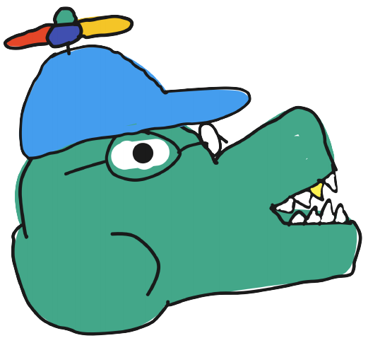

# Overview
This document details how to modify, use and deploy the DSA website. The goal of the DSA website is to provide users with information regarding club events, club members, contact information, and related photos.
# <a href="https://dsa-web.herokuapp.com/"> Live Deployment </a>
\
# Getting Started
### Clone this repository 
This command can be used to clone the project
```
git clone https://github.com/DSA-Developers/dsa-web.git
```
### Install the required dependencies
Navigate to the directory and run the command
```
yarn install
```
to install the required dependencies. This project uses the following:
<ul>
  <li><a href="https://github.com/neptunian/react-photo-gallery"> React Photo Gallery </a></li>
  <li><a href="https://simple-react-lightbox.dev/"> Simple React Lightbox </a></li>
  <li><a href="https://enzymejs.github.io/enzyme/"> Enzyme </a></li>
  <li><a href="https://github.com/styled-components/styled-components"> Styled Components </a></li>
  <li><a href="https://github.com/react-bootstrap/react-bootstrap"> React Bootstrap </a></li>
  <li><a href="https://firebase.google.com/"> Firebase </a></li>
  <li><a href="https://www.npmjs.com/package/react-router-dom"> React Router Dom </a></li>
  <li><a href="https://jestjs.io/"> Jest </a></li>
</ul>

### Run the development server
You can run the development server with the command
```
yarn start
```
The server will be hosted at http://localhost:3000 where you can see the project being run.
### Testing
Testing can be done with
````
yarn test
````
Make sure to run all tests (by pressing the ```a``` key ) and update them (pressing the ```u``` key after the inital tests are run) before commiting code. Tests utilize Jest and Enzyme.
\
# About the devs
</img>
Made with ♥ by Americos Perez, Matthew Iglesias, Julia Nguyen, and Noah Meininger.
